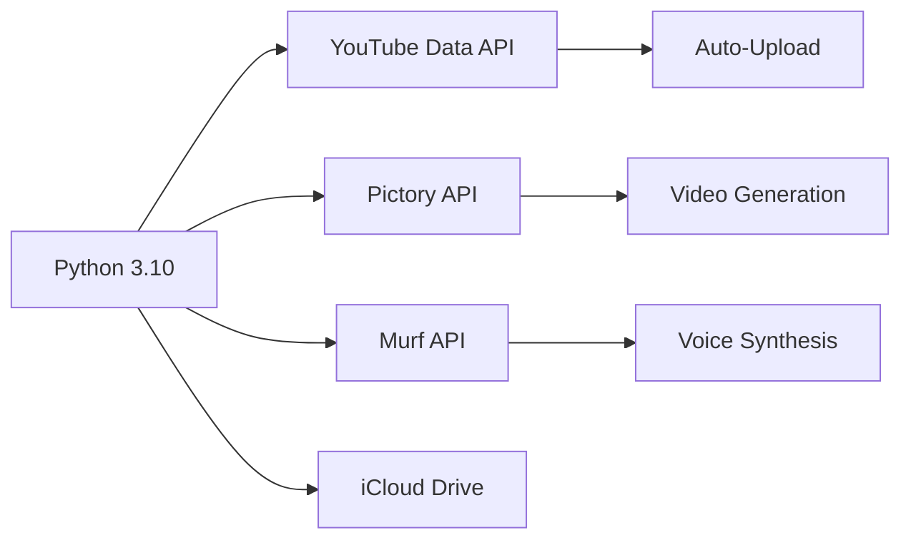

# 🚀 YouTube-AutoUploader (macOS Edition)

[](https://www.python.org/)
[](https://opensource.org/licenses/MIT)
[](https://www.apple.com/macos)

Vollautomatisiertes System zum Erstellen und Hochladen von YouTube-Videos mit KI-Unterstützung. Speziell für macOS optimiert.

## 🌟 Hauptfeatures
- ⏰ Zeitgesteuerte Uploads (08:00, 12:00, 18:00 Uhr MEZ)
- 🤖 KI-Videogenerierung mit Pictory/Murf-APIs
- 🔐 Automatische Token-Verwaltung
- 📊 Umfangreiches Logging
- 🍏 macOS Integration (Launchd, iCloud Sync, Automator)

## ⚙️ Technischer Stack


## 🛠️ Installation (macOS)

### Voraussetzungen
- macOS 11 Big Sur oder neuer
- Python 3.10+ (empfohlen mit [Homebrew](https://brew.sh/))
```bash
/bin/bash -c "$(curl -fsSL https://raw.githubusercontent.com/Homebrew/install/HEAD/install.sh)"
brew install python
```

### Schritt 1: Repository klonen
```bash
git clone https://github.com/Widder-cpu/YouTube-AutoUploader.git
cd YouTube-AutoUploader
```

### Schritt 2: Virtuelle Umgebung einrichten
```bash
python3 -m venv venv
source venv/bin/activate
```

### Schritt 3: Abhängigkeiten installieren
```bash
pip install -r requirements.txt
```

## 🔧 Konfiguration

### Schritt 4: Google API-Zugangsdaten
1. Google Cloud Console öffnen: https://console.cloud.google.com/
2. Neues Projekt erstellen: "YouTube-AutoUploader"
3. YouTube Data API v3 aktivieren
4. OAuth-Zustimmungsbildschirm konfigurieren (externe Nutzer)
5. OAuth-Client-ID erstellen (Typ: "Desktop-App")
6. JSON herunterladen und in `config/client_secret.json` speichern

### Schritt 5: Service mit launchd einrichten
```bash
nano ~/Library/LaunchAgents/com.youtube.autouploader.plist
```

Fügen Sie diesen Inhalt ein (Pfade anpassen!):
```xml
<?xml version="1.0" encoding="UTF-8"?>
<!DOCTYPE plist PUBLIC "-//Apple//DTD PLIST 1.0//EN" "http://www.apple.com/DTDs/PropertyList-1.0.dtd">
<plist version="1.0">
<dict>
    <key>Label</key>
    <string>com.youtube.autouploader</string>
    <key>ProgramArguments</key>
    <array>
        <string>/Pfad/zum/venv/bin/python</string>
        <string>/Pfad/zum/YouTube-AutoUploader/uploader.py</string>
    </array>
    <key>RunAtLoad</key>
    <true/>
    <key>StandardOutPath</key>
    <string>/Pfad/zum/YouTube-AutoUploader/logs/launchd.log</string>
    <key>StandardErrorPath</key>
    <string>/Pfad/zum/YouTube-AutoUploader/logs/launchd-errors.log</string>
    <key>EnvironmentVariables</key>
    <dict>
        <key>PATH</key>
        <string>/usr/local/bin:/usr/bin:/bin:/usr/sbin:/sbin</string>
    </dict>
</dict>
</plist>
```

Service aktivieren:
```bash
launchctl load ~/Library/LaunchAgents/com.youtube.autouploader.plist
```

## 🚀 Verwendung

### Manueller Start
```bash
source venv/bin/activate
python uploader.py
```

### Automatischer Start
Der Service läuft automatisch im Hintergrund nach Systemstart.

### Automator-Service für schnellen Zugriff
1. Automator öffnen > "Schnelle Aktion"
2. "Shell-Skript ausführen" hinzufügen:
```bash
cd /Pfad/zum/YouTube-AutoUploader
source venv/bin/activate
python uploader.py
```

## 📂 Projektstruktur
```
├── config/
│   ├── client_secret.json    # Google API-Zugangsdaten
│   └── token.json            # Automatisch generiertes Token
├── venv/                     # Virtuelle Umgebung
├── videos/                   # KI-generierte Videos
├── logs/                     # Systemprotokolle
├── .gitignore                # Ignorierte Dateien
├── uploader.py               # Hauptskript
├── requirements.txt          # Abhängigkeiten
└── README.md                 # Diese Datei
```

## 🍎 macOS Tipps

### iCloud-Synchronisation
```bash
mkdir -p ~/Library/Mobile\ Documents/com~apple~CloudDocs/YouTube-AutoUploader
ln -s ~/Library/Mobile\ Documents/com~apple~CloudDocs/YouTube-AutoUploader/ config/icloud
```

### Dock-Shortcut
1. Skript erstellen: `~/yt_uploader.command`
```bash
#!/bin/bash
cd /Pfad/zum/YouTube-AutoUploader
source venv/bin/activate
python uploader.py
```
2. Ausführbar machen: `chmod +x ~/yt_uploader.command`
3. Im Finder: Rechtsklick > "Alias erstellen"
4. Alias in Dock ziehen

### iCloud-Backup
```bash
# Tägliches Backup einrichten
(crontab -l ; echo "0 3 * * * rsync -a /Pfad/zum/YouTube-AutoUploader/ ~/Library/Mobile\ Documents/com~apple~CloudDocs/YouTube-Backup/") | crontab -
```

## 🔒 Sicherheit
- **Sensible Daten niemals committen!**
- Nutzen Sie `.gitignore` für:
  ```
  config/token.json
  config/client_secret.json
  .env
  venv/
  videos/
  logs/
  ```

## ❓ Hilfe
Bei Problemen:
1. Logs prüfen: `tail -f logs/system.log`
2. Service neu starten: 
```bash
launchctl unload ~/Library/LaunchAgents/com.youtube.autouploader.plist
launchctl load ~/Library/LaunchAgents/com.youtube.autouploader.plist
```

## 📜 Lizenz
[MIT](https://choosealicense.com/licenses/mit/) - Freie Nutzung, Anpassung und Verteilung erlaubt.

